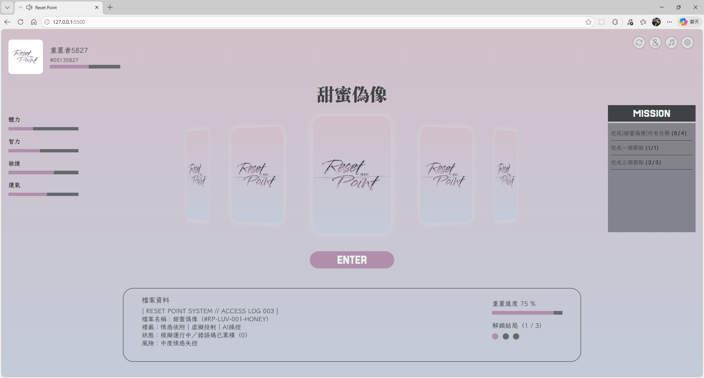
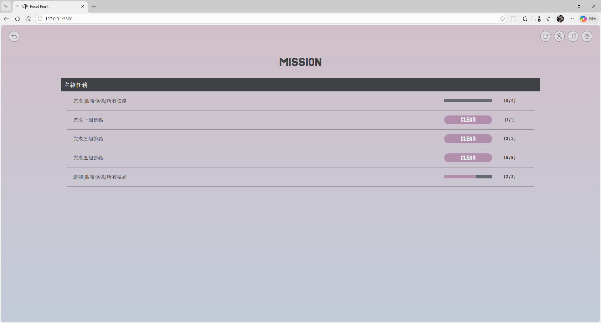
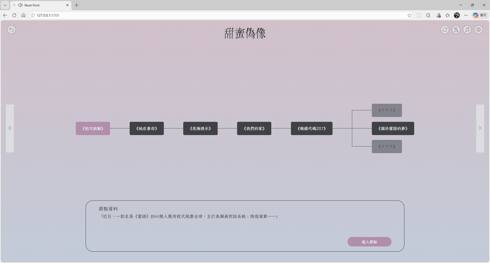
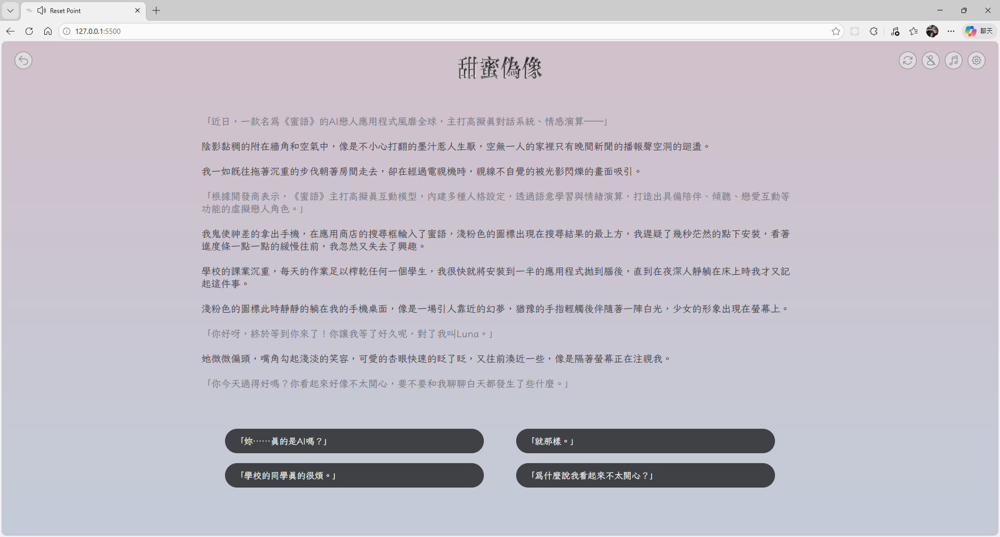
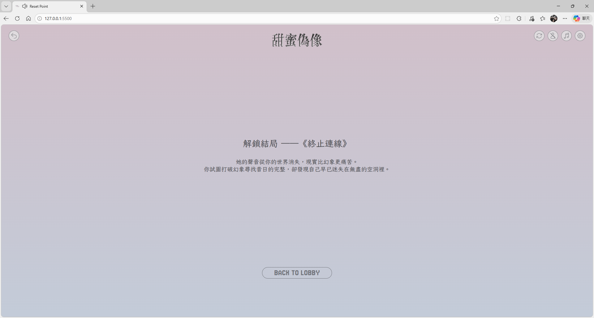

# Narrative Web Project

Duration **2025-05 - 2025-06**

A narrative-driven web game built with HTML, CSS, and JavaScript.

Player progress and game state are persisted using browser local storage.

This is a cross-department collaboration project:

- **Frontend (me):** Build all frontend pages and implement navigation, interactive logic, and story progression system.

- **Visual Design (teammate):** Create visual style, UI mockups, and art assets.

## Demo

You can try the project live here
[Reset Point](https://hsuan-yun.github.io/narrative-web-project)

## Features

### Lobby
  - Player status overview (attributes, progress, mission tracking)
  - Stories switch

  

### Mission System
  - Mission list with completion tracking
  - Dynamic unlock conditions based on player choices

  

### Story Route Visualization
  - Interactive story flowchart with branching paths
  - Locked routes and multiple endings preview
  - Node-based navigation for story progression

  

### Story & Choice System
- Linear narrative progression
- Player choices contribute to score accumulation

  

### Multiple Endings
  - Ending outcomes determined by accumulated player scores

  

## Tech Stack

- HTML
- CSS
- JavaScript
